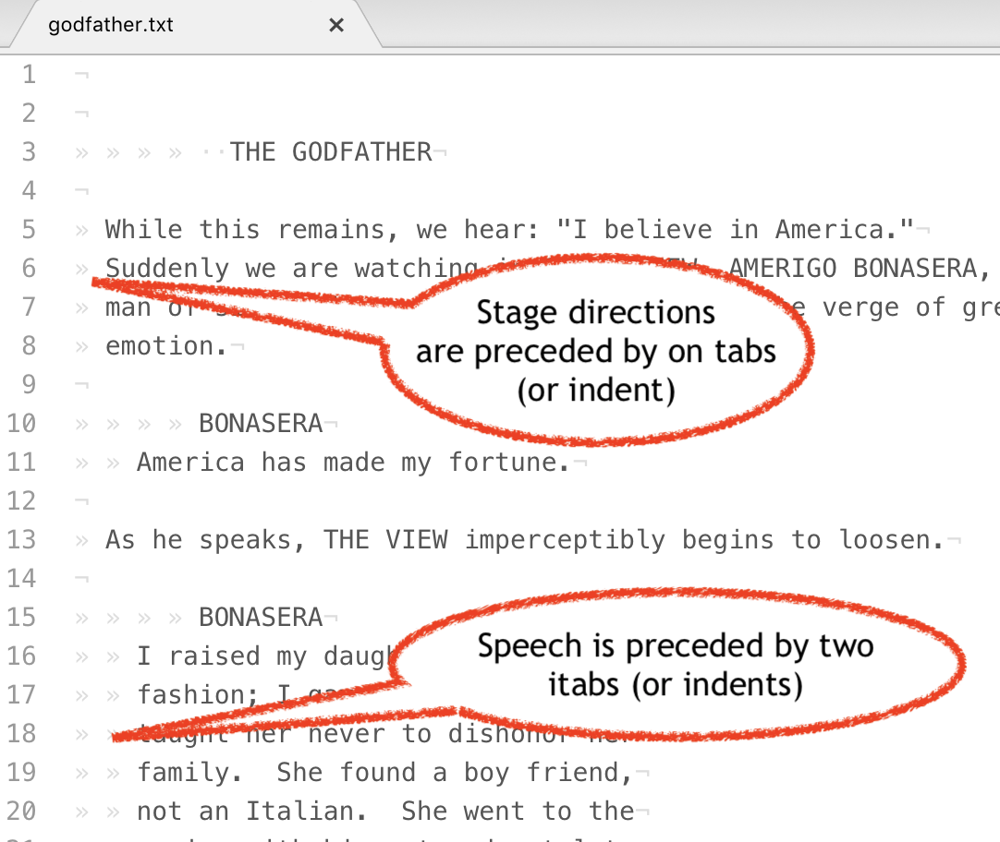
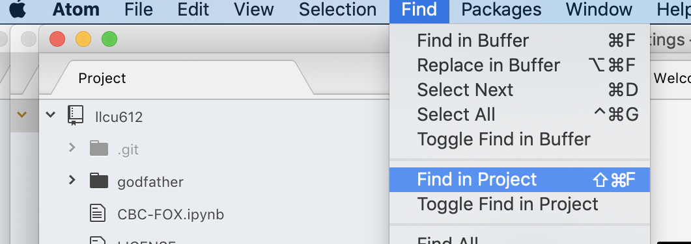
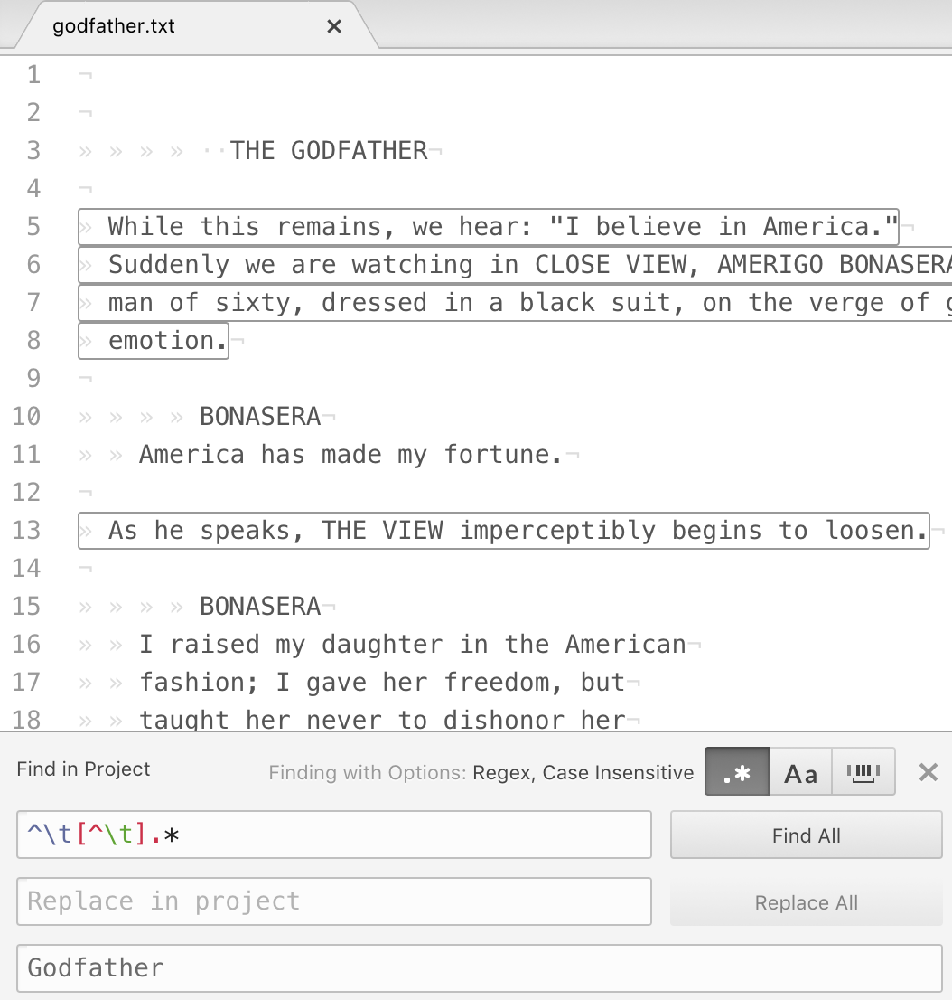

# Format Conversion with Web Scraping with the Art of Literary Text Analysis

This is part of the [Art of Literary Text Mining](../) collection. This page is intended to briefly describe how to get started with format conversion, particularly with Juypter Notebooks.

### Plain Text

For better or for worse, the vast majority of text mining projects either start with plain text versions of the documents, or convert existing document to plain text. There are some projects and some tools that make use of markup in the text during analysis, but they're relatively rare (we'll see some examples later in the guide).

We identify three major kinds of conversion and pre-processing steps:

1. files are already in plain text but require some cleaning (to remove a license statement or regular page numbers, for instance)
1. files are in HTML or XML format in ways that are conducive to text extraction (we've already seen) and other pre-processing (especially thanks to libraries like BeautifulSoup)
1. files are in some other format that may require special or manual handling, especially for binary formats like MS Word and PDF.

For documents that are already in plain text, the easiest is often to make changes manually in the files or to use an application to make the same changes in multiple documents at a time (if the editor supports such functionality).

Let's work through a real example, three drafts screenplays for The Godfather movies, available from [IMSDb search](https://www.imsdb.com/search.php). If you type "Godfather" in the search you should get three hits:

#### Search results for 'godfather'

	Godfather (1971-03 Draft)
		Written by Mario Puzo,Francis Ford Coppola
	Godfather Part II (1973-09 Draft)
		Written by Mario Puzo,Francis Ford Coppola
	Godfather Part III, The (1979-03 First draft)
		Written by Mario Puzo,Francis Ford Coppola

Let's just work with two of the three scripts, the first two (the third has a slightly different format that confuses things somewhat, though it would be possible to use as well). Near the bottom of the first section and near the bottom of the page you'll find links to _Read "Godfather" script_, we can compile links for each document:

https://www.imsdb.com/scripts/Godfather.html
https://www.imsdb.com/scripts/Godfather-Part-II.html

Rather than save the HTML file to our hard drive, we will select the actual script and copy it into the clipboard (starting with **_THE GODFATHER_** and going until **THE END**: select that entire section and then copy it into the clipboard.

Now we need a plain text editor. Several very good ones exist, including [TextMate](https://macromates.com) for Mac and [Sublime](https://www.sublimetext.com) for multiple platforms, but we will use [Atom](https://atom.io), a relatively new kid on the block that has excellent GitHub integration. Start by downloading Atom, unzipping the download and placing the executable where you want it (I put in my Applications folder).

When Atom first opens you should open your LLCU-212 GitHub folder (any folder can be a project). Then from the _File_ menu select _Add Project Folder…_ and add a folder calld "Godfather" (without the quotes). Finally you can select _New File_ from the _File_ menu, paste the screenplay into the document, and then save the file in the "Godfather" folder with the name "Godfather.txt". Next get the [second screenplay](https://www.imsdb.com/scripts/Godfather-Part-II.html), select the actual text, copy to the clipboard, return to Atom, choose _New File_ from the _File_ menu, paste the contents, and save in the "Godfather" as "Godfather2.txt".

Without much fanfare we just demonstrated a simple but powerful mechanism for converting between formats. The original web page was in HTML and when we copied the screenplay into the clipboard it was still styled text (you can see this if you paste the same text into a styled editor like MS Word). However, when you paste HTML or styled text into a text editor you also convert your document to plain text. Needless to say things like images will be lost, but in our case all we really need is the plain text, so this operation is suitable.

If you keep the Godfather screenplay open you can see some layout particularities. Namely, stage directions are all preceded with a single tab (then other characters) whereas speeches are all preceded by a double-tag (then other characters).

If we wanted to remove all the stage directions, one way to do so would be to select and remove all lines that have only a single tab. That's where regular expressions come in.

[Regular Expressions](https://en.wikipedia.org/wiki/Regular_expression) are a powerful mechanism for not only identifying characters, but also invisible characters (tabs, newlines, etc.), character classes (lowercase characters, digits), and a whole bunch of other things. We won't go deep into regular expressions here, but suffice it to introduce a few very common aspects of the syntax:

* **.**: any character
* **\w**: any ASCII letter or word character (a to z)
* **\d**: any digit (number)
* **\t**: a tab character
* **\n**: a newline character
* **\s**: a whitespace character
* **[aeiou]**: any of the character enumerated
* **[a-z]**: any character in the range
* **[^aeiou]**: none of the characters mentioned
* **^**: zero-length match at the start of a line
* **$**: zero-length match at the end of a line
* **\b**: zero-length match of a word boundary
* **(one|two)**: any word between the pipes

In addition, there are ways of repeating these forms:

* **.\***: zero or more times
* **.?**: zero or one times
* **.+**: one or more times
* **.{5}***: five times
* **.{2,5}**: two to five times

Now that we have our two data files in place, we can demonstrate the powerful search and replace capabilities. We will jump straight to replacing things in multiple files, but of course Atom has a more conventional search and replace mechanism for the currently open file. Replacing across documents is powerful because it can be performed on one or on hundreds or more documents at once; a type of automation (without programming).

From the _File_ menu, select _Find in Project_ (on Mac the shortcut is Command-Shift-F).

That will cause a dialog to appear near the bottom of the page.

In the first box we have `^\t?[^\t].*`:

* **^**: match to the beginning of the line
* **\t?**: match zero or tab characters
* **[^\t]**: match anything except a tab character
* **.\***: match until the end of the line

We also add the "Godfather" in the bottom box to ensure that the search and replace only happens in our new data directory. And presto! We have gotten rid of stage directions (assuming that's what we wanted).

## Jupyter Notebook

 Using a friendly application like Atom is usually preferable and quicker than writing code ourselves, but there are times where having code is preferable, especially when the circumstances are more complex. Another reason to use code is that the code can be repeatedly re-run whereas the steps taken in the application probably have to be repeated manually each time.

We demonstrate a similar situation with the [Converting notebook]()
## Voyant

