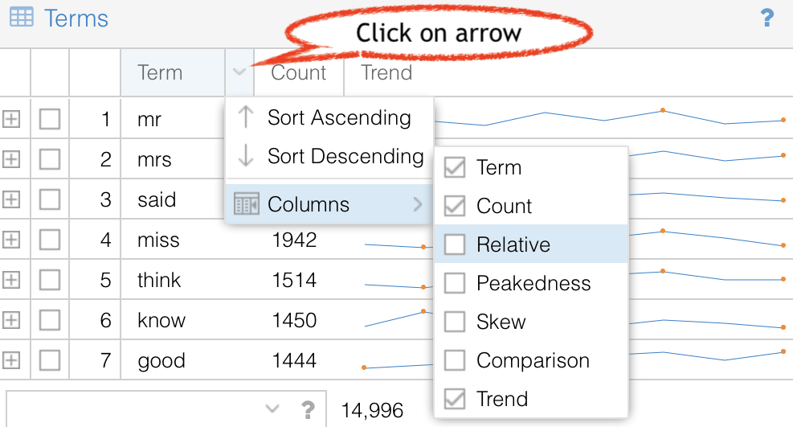

# Counting with the Art of Literary Text Analysis

If you've been following along this [guide series](../) we've now looked at various basic concepts involved in building a corpus, including web scraping and pre-processing texts for things like cleanup and format conversion. We have our texts, now what?

One of the simplest but most significant tasks that we can do with a textual corpus is to count various occurrences. We can do this for its own purpose – for instance if we want to find a sequence of characters or if we want to know how many times a given phrase appears – but counting is also an analytic primitive that is part of many other more sophisticated tasks, such as distribution analysis, finding similar documents, and countless other operations.

## Counting with Voyant

 We are going to visit many of the core concepts of counting with Voyant Tools, in large part because the functionality is easily accessible, which will allow us to focus on the concepts.

To fully understand counting of text it's useful to revisit how computers encode and process data, and text in particular. As is commonly known (though perhaps not fully understood), computers store information in a binary format, which essentially means that everything is based on a system of choices between two values, namely zero and one (that in turn can be used by a computer transister to send either a low or high current of electricity, also a binary state.

If I have one column with which to store data, I have two possible values: zero or one (black or white, heads or tails, etc.). If I have two columns, I now have 4 different possibilities (00, 01, 10, 11), I can multiply two for each column I have to determine the number of possibilities.

| bits | possibilities | equation | exponent | example |
|-|-|-|-|-|
| 1 | 2 | 2x1 | 21 | 0 |
| 2 | 4 | 2x2 | 22 | 01 |
| 3 | 8 | 2x2x2 | 23 | 010 |
| 4 | 16 | 2x2x2x2 | 24 | 0101 |
| 5 | 32 | 2x2x2x2x2 | 25 | 01010
| 6 | 64 | 2x2x2x2x2x2 | 26 | 010101
| 7 | 128 | 2x2x2x2x2x2 | 27 | 0101010
| 8 | 256 | 2x2x2x2x2x2x2 | 28 | 01010101

As we can see the number of "bits" (left column) corresponds with the number of digits (or columns), as shown in the right column ("example"). We haven't explained how to decipher binary into comprehensible information, but we have explained the basics of how binary and bits work.

If I'm trying to represent heads or tails I only need one bit (with two possibilities). If I need to represent the 26 letters of the alphabet (in lowercase) I need at least 5 bits (with 32 possibilities. If I want upper and lowercase characters as well as punctuation and so on, I need even more bits. It has become standard to work with units of 8 bits, also called one byte (with 256 possibilities). When we hear 8-bit that's what is being said, that there are 256 different possibilites (such as a gif image that can have up to 256 different colours).

1 byte (8 bits) is plenty to represent texts using our English alphabet and even accented characters like "é" or "ñ", but woefully insufficient for other languages like Mandarin with its some 50,000 ideogram characters (here's a mini exercise: how many bits are needed to represent that many possibilities)? For the past couple of decades the dominant standard for encoding text is Unicode. Plain texts with our alphabet typically use UTF-8 where the 8 indicates 8 bits, but it's also possible to have up to UTF-32 (32 bits or 4 bytes or over 4 billion possibilities). It can be useful to know that UTF-16, for instance, is actually composed of a character that span across two bytes – in other words, the byte is still the core unit of encoding. Occasionally one might see a file or web page that has strange characters in it, sometimes that can be because two-byte characters are being interpreted incorrectly as one-byte characters (or vice-versa, it should be possible to fix that by re-opening the file with the correct character encoding).

So text is encoded in bits and bytes. When we ask the computer to find text, or a string sequence, we're asking it to find a matching set of bytes. Counting is similar, it's a matter of seeing how many times the byte sequence occurs. But it can also lead to surprising results. Imagine we are searching for the text "dog", without further instructions we might also inadvertently match the word "dogs" (which may be desirable) but also the word "dogmatic" (which probably isn't, unless we're reading the French comic book _Asterix_ in translation (the dog is named "Idéfix" in French and "Dogmatix" in English, surely one of the most inspired translations in history).

Some systems, like Voyant, go through a process of tokenization, which means trying to identify (and then count) words. But even the concept of word is slippery and contextual. For instance, is "don't" one word or two ("don" and "t" – or should it be modified "do" and "not")? Is "computer-assisted" one or two words? What about hyphenated proper names? In some cases we can delay choosing how to treat such words, in other cases (like Voyant) the decision must be made when creating the corpus (see the [tokenization](https://voyant-tools.org/docs/#!/guide/corpuscreator-section-tokenization) options in Voyant).

So, after these brief digressions into character encoding and tokenization we can now dive into working in Voyant. If you haven't already followed the [Getting Started](https://voyant-tools.org/docs/#!/guide/starthttps://voyant-tools.org/docs/#!/guide/start) in Voyant guide, you're *strongly* encouraged to do so. That guide is quick, if you want a deeper introduction to Voyant, it would also be well worth following the [Voyant tutorial](https://https://voyant-tools.org/docs/#!/guide/tutorialvoyant-tools.org/docs/#!/guide/tutorial).

Counting is a key part of the default view of Voyant, in some ways every tool of the main interface uses counting of words.

<iframe src="https://voyant-tools.org/?corpus=austen" style="width: 100%; height: 600px;"></iframe>

The Cirrus (word-cloud) tool is about term frequency (position the cursor over terms to see their frequency). Clicking on a term in Cirrus also shows frequency information in the upper middle Reader tool. In the upper-right is the Trends tool which is a combination of counting and distribution. In the bottom right-hand is the Summary tool which contains various counts (number of documents, number of words in the corpus, number of unique words in the corpus, number of words per document, frequency of distinctive words per document, etc.). Finally, the default view also shows the Keyword in context which finds occurrences of words. All five of the tools in the default view rely on term counts, as do most of the other 20 or so tools that are available in Voyant (you can switch tools by clicking on the window icon that appears in the grey header bars of any of the tools.

One of the most useful tools for counting terms isn't shown by default, but it is easily accessible by clicking on the "Terms" tab in the upper left-hand tool where Cirrus is by default.

<iframe src="https://voyant-tools.org/tool/CorpusTerms/?corpus=austen" style="width: 400px; height: 400px;"></iframe>

The default view of _Terms_ shows a list of high frequency words with their count and a mini-graph (called a sparkline in this case) that shows the distribution of the word across the corpus, in this case 8 novels from Jane Austen.

It's possible to view additional information about a term by clicking the plus icon in the left-most column, this expands a panel with additional information about the following:

* **Distribution**: another view of the sparkline
* **Collocates**: other terms that occur in higher frequency near this term
* **Correlations**: terms whose frequencies increase or decrease at a similar rate has this term
* **Phrases**: multi-word phrases that repeat and that start with this term (if applicable).

It's possible to scroll down to lower frequency words, new words will be loaded as necessary. This is sometimes call infinite scrolling though that's a bit misleading since there's a finite number of words in the corpus and eventually we would reach the bottom.

If for some reason we're more interested in sorting alphabetically rather than by frequency, it's possible to click on the "Term" header in the table.

It's important to recognize early that what we are seeing is a list of high frequency words, but not necessarily all the words, since there's automatically a stoplist that's applied; a stoplist is like a blacklist of words to be ignored. It's typically populated by many function words like determiners "the", "a" and other words that don't carry much meaning (such as prepositions, pronouns, and others).

It's possible to edit the stoplist by clicking on the options icon in the grey title bar (the bar with "Terms" near the top, icons will appear on the right while hovering, we want the one that looks like a slider option. We can click on that and proceed to select another list or edit the existing list (it's a very good idea to look at what's in that list, there may be some surprises). You can remove words or add words in the editor, see the [Stoplist](https://voyant-tools.org/docs/#!/guide/stopwords) documentation for more information.

If you want to keep your edited stopword list, remember to export a URL (using the export icons in the header bar) to ensure that the new list is included (otherwise the default list will be shown next time the URL is visited).

Voyant is designed to be user-friendly, which sometimes means showing the most useful information (to avoid overwhelming the user) while making other information available through additional steps. That's the case with the _Trends_ tool, and several other table or [grid-based tools](https://voyant-tools.org/docs/#!/guide/grids). To access additional functionality, click the down arrow that should appear in a column header when you're hovering (especially the "Terms" or "Count" headers).

As can be seen, several options exist, including to show:

* **Term**: this is the term in the corpus
* **Count**: this is the frequency of the term in the corpus
* **Trends**: this is a sparkline graph that shows the distribution of relative frequencies across documents in the corpus (if the corpus contains more than one document); you can hover over the sparkline to see finer-grained results
* **Relative**: this is the relative frequency of the term in the corpus, per one million words (sorting by count and relative should produce the same results, the relative frequencies might be useful when comparing to another corpus)
* **Comparison**: this is the relative frequency of the term in the corpus compared to the relative frequency of the same term in a comparison corpus; to specify the comparison corpus, click the Options icon and specify the comparison corpus to use
* **Peakedness**: this is a statistical measure of how much the relative frequencies of a term in a corpus are bunched up into peaks (regions with higher values where the rest are lower)
* **Skew**: this is a statistical measure of the symmetry of the relative frequencies of a term across the corpus

Although Peakedness and Skew start to seem like advanced statistical measures, they can reveal some interesting characteristics about the general trends for term frequency in a corpus (they aren't as useful for a corpus with a single document, but there's a specialized [Document Terms](https://voyant-tools.org/docs/#!/guide/documentterms) tool that presents other useful information.

The _Terms_ tool provides various counts of an existing list, but one of the most powerful features of Voyant is search, which can be done using the box in the bottom part of the tool. The following provides a guide to the supported syntax (see also [Search](https://voyant-tools.org/docs/#!/guide/search)):

* [`love`](https://voyant-tools.org/?corpus=austen&query=love&view=CorpusTerms): match **exact term** love
* [`love*`](https://voyant-tools.org/?corpus=austen&query=love*&view=CorpusTerms): match terms that start with the **prefix** love and then a **wildcard** as **one term**
* [`^love*`](https://voyant-tools.org/?corpus=austen&query=^love*&view=CorpusTerms): match terms that start with love as **separate terms** (love, lovely, etc.)
* [`*ove`](https://voyant-tools.org/?corpus=austen&query=ove*&view=CorpusTerms): match terms that end with the **suffix** _ove_ as **one term**
* [`^*ove`](https://voyant-tools.org/?corpus=austen&query=^love*&view=CorpusTerms): match terms that end with **suffix** _ove_ as **separate terms** (love, above, etc.)
* [`love,hate`](https://voyant-tools.org/?corpus=austen&query=love,hate&view=CorpusTerms): match each term **separated by commas** as **separate terms**
* [`love\|hate`](https://voyant-tools.org/?corpus=austen&query=love\|hate&view=CorpusTerms): match terms **separated by pipes** as a **single term**
* [`"love him"`](https://voyant-tools.org/?corpus=austen&query="love him"&view=CorpusTerms): _love him_ as an exact **phrase** (word order matters)
* [`"love him"~0`](https://voyant-tools.org/?corpus=austen&query="love+him"~0&view=CorpusTerms): _love him_ or _him love_ **phrase** (word order doesn't matter but 0 words in between)
* [`"love her"~5`](https://voyant-tools.org/?corpus=austen&query="love+her"~5&view=CorpusTerms): match _love_ **near** _her_ (within 5 words)
* [`^love*,love\|hate,"love her"~5`](https://voyant-tools.org/?corpus=austen&query=^love*,hate\|love,"love+her"~5&view=CorpusTerms): **combine** syntaxes

Can you find what you're looking for?
