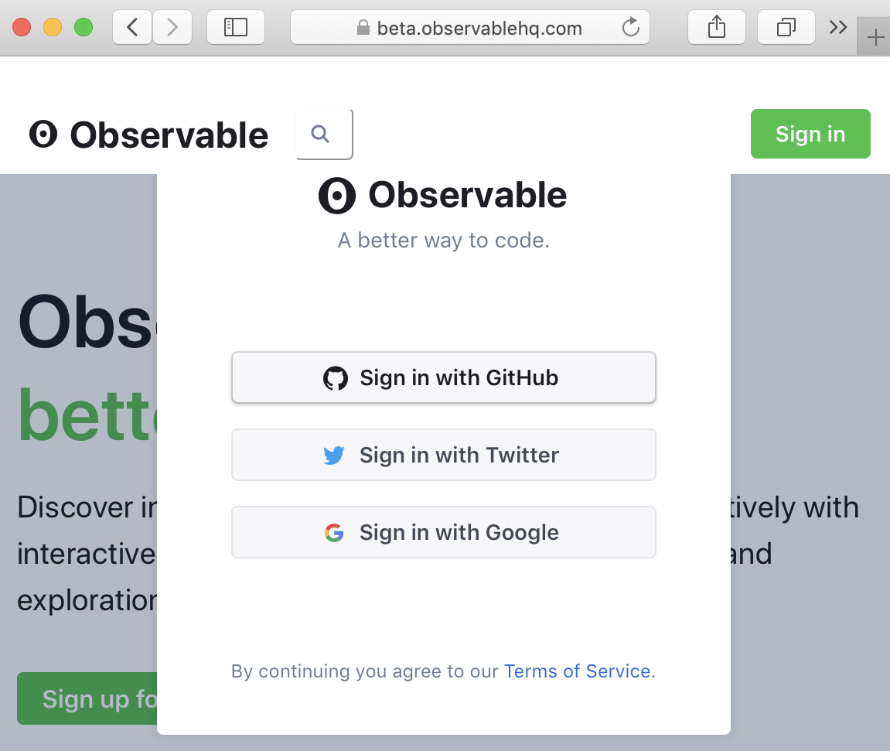

# The Art of Setting up Literary Text Mining

This is part of the [Art of Literary Text Mining](../) collection. This page is intended to briefly describe how to get setup and configured with our three environments: Voyant Tools, Juypter Notebooks, ObservableHQ.

## Setup

The first step with any tool or framework is to ensure that whatever setup and configuration needed are performed. Because of the nature of the technologies the work involved is different for each of our guides.

### Voyant

 Voyant Tools is a hosted website [voyant-tools.org](https://voyant-tools.org) that requires no setup, no login, and no configuration. However, that simplicity comes with a price: the hosted version is widely used by people all over the world and that excerpts pressure on the server, which sometimes causes downtime and other issues. For this reason (and others, such as data privacy), it's highly recommended that you [download and install the Desktop version of Voyant Tools](https://github.com/sgsinclair/VoyantServer/wiki/VoyantServer-Desktop) – in most cases it's as simple as downloading a zip file, uncompressing it, and clicking on the application launcher.

As mentioned, the hosted version is sometimes over-extended. If the server doesn't seem to respond, wait a few seconds, up to a minute, and try again (the server usually restored itself within a few seconds).

If you're trying to get the Desktop version functioning and it won't, there are three common issues to check:

1. [On Windows](https://github.com/sgsinclair/VoyantServer/wiki/VoyantServer-Desktop#windows), be sure that you extracted the downloaded VoyantServer.zip file into a real directory, not just double-click on the ZIP file to uncompress it.

1. [On Mac](https://github.com/sgsinclair/VoyantServer/wiki/VoyantServer-Desktop#mac), the first time you launch VoyantServer, you should right-click or ctrl-click on the VoyantServer.jar file as this will allow you to circumvent the operating system's security block for unsigned applications.

1. Check the memory [settings](https://github.com/sgsinclair/VoyantServer/wiki/VoyantServer-Desktop#settings): if you have an older machine with a limited amount of RAM memory, try opening the file called `server_settings.txt` in the same directory as VoyantServer.jar and change the value "1024" to "512" (or even "256") before saving the text file and trying to relaunch VoyantServer.

### Jupyter Notebooks

 Jupyter tends to be the most intensive solution to setup and configure, especially if you set it up on your local machine. There are a lot of instructions out there for getting setup, especially depending on platform on system preferences, but the [Getting Setup notebook](https://nbviewer.jupyter.org/github/sgsinclair/alta/blob/master/ipynb/GettingSetup.ipynb) is a good place to start.

The recommended approach is to intall Anaconda on your system. Think of Anaconda its own environment that's installed on your system and that is isolated from other important system files. Anaconda is a sandbox that contains the Jupyter application and the Jupyter application allows you to create Jupyter notebooks.

Unlike Voyant and ObservableHQ that are always-available web applications, Jupyter Notebooks has to be launched and be running in order to be used. This is an important distinction from our other environments: a "live" notebook (that can be edited) must have a process running somewhere, most likely on your computer. That process stores current contents in memory and handles the execution of code. So getting started each time will involve the following steps:

1. launch Anaconda Navigator (from your applications or desktop)
1. launch Jupyter Notebooks (from Anaconda Navigator, which launches browswer window)
1. create or open a Juypyter Notebook (in browser)

As we proceed we will want to use some Python helper libraries that are not installed by default in Anaconda. We will return to this, but it's worth emphasizing now that installation happens within our Anaconda environment (and doesn't interfere with other system files). Similarly, it's possible to have multiple Anaconda installations that are independent, but for now we'll assume that we have one installation and that any modifications happen to that one installation.

### ObservableHQ

 ObservableHQ is also a hosted website [observablehq.com](https://observablehq.com). It's possible to visit ObservableHQ and make anonymous changes to a notebook (like [this one](https://beta.observablehq.com/@observablehq/fork-share-merge)), but in order to save changes you need to login through one of the authentication services (currently GitHub, Twitter and Google – because we can use GitHub to store data, we strongly recommend that option).

