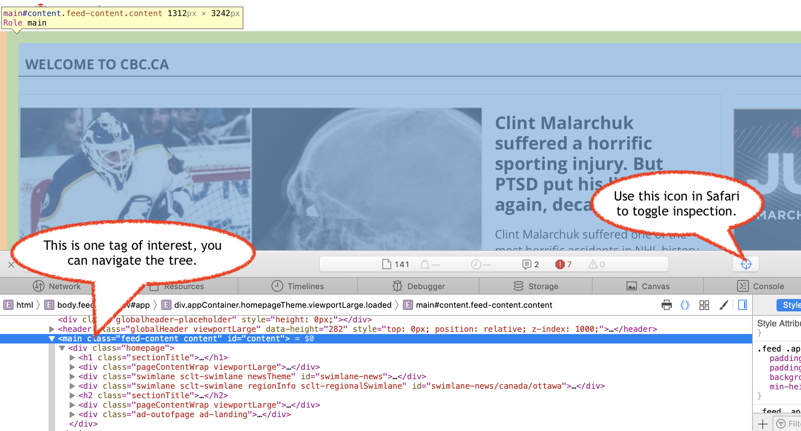
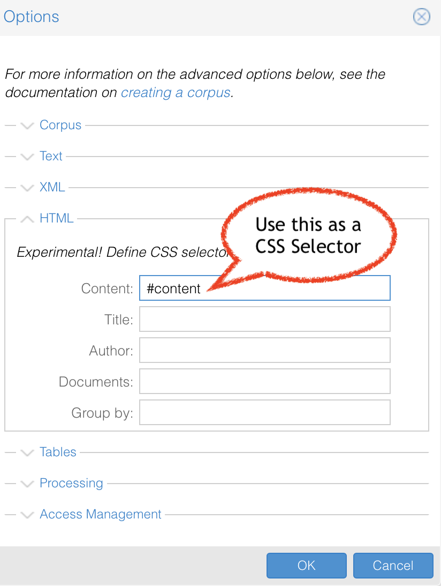

# Getting Started with the Art of Literary Text Analysis

This is part of the [Art of Literary Text Mining](../) collection. This page is intended to briefly describe how to get started with our three environments: Voyant Tools, Juypter Notebooks, ObservableHQ.

So you want to do some text analysis, but where to start? Let's imagine that we have a favourite news source and we want to try to determine what's being discussed (without necessarily just reading the front page articles). You can do this with most websites and media outlets, but for the purposes of this example, let's say that we want to look at the Canadian Broadcasting Corporation (Canada's public Anglophone broadcaster) at [CBC.ca](https://cbc.ca).

## Voyant

 In Voyant analyzing the contents of a URL is dead simple, all that needs to be done is to visit the main page [voyant-tools.org](https://voyant-tools.org) and paste in the URL of interest. We can also use the query parameters (part of the URL) to specify an input argument:

[https://voyant-tools.org/?input=https://cbc.ca](https://voyant-tools.org/?corpus=9094634e2f37d5e29cf93431c4c7bb5a&input=https://www.cbc.ca)

The full interface can show some interesting aspects, but even just the summary points out some interesting aspects. For instance, even though the CBC page is essentially a compilation of blocks linking to other pages we can see that our corpus contains only one document:

<iframe src="https://voyant-tools.org/?corpus=9094634e2f37d5e29cf93431c4c7bb5a&input=https://www.cbc.ca&view=summary" style="width: 50%; max-width: 500px; height: 300px"></iframe>

We said we wouldn't read the page directly, but it is worth having a look at what exactly we caught when we cast the net over the URL. To do that, we could have a look at the [Reader](https://voyant-tools.org/docs/#!/guide/reader) tool in Voyant.

<iframe src="https://voyant-tools.org/?corpus=9094634e2f37d5e29cf93431c4c7bb5a&input=https://www.cbc.ca&view=reader" style="width: 50%; max-width: 500px; height: 300px"></iframe>

What we see is that there's a main title on the page "CBC.ca - watch, listen, and discover with Canada's Public Broadcaster…" but there's also navigational items like "Skip to Main Content", "CBCMenu", and "Search". While there's nothing wrong with that necessarily, it may be misleading to think that the news is talking about search (and rescue, for instance), when we have a keyword that is really from the navigational elements of the page (sometimes called paratextual elements). Can we do better?

 We can, and the way we do that is to dive into an exploration of what's called the [Document Object Model](https://en.wikipedia.org/wiki/Document_Object_Model), that is, the hierarchical elements that are part of the tree of this web document.

### The DOM and CSS Selectors

HTML is a markup language that starts with a root node or tag (usually &lt;html&gt;), then splits into a &lt;head&gt; and a &lt;body&gt;, each of which may have its own children nodes (or tags or text). Within the DOM there are also ways of identifying unique elements and group similar elements into a class of objects that share some characteristics. This is precisely the syntax that's used to add styling to pages using Cascading Stylesheets (CSS).

| Examples | Type | Explanation |
|-|-|-|
| body, p | tag name selector | select every tag that is either &lt;body&gt; or &lt;p&gt; |
| #mainsection | ID selector | select the unique element with matching ID, as in &lt;div id="mainsection"&gt; |
| .insight | class selector | select all elements with matching class, as in &lt;div class="insight"&gt; |

The syntax of CSS Selectors is actually [much more powerful](https://en.wikipedia.org/wiki/Cascading_Style_Sheets#Selector), but for now this will suffice.

So, back to our CBC news page, how do we clean up the input a bit? We can explore the DOM in the browser using built-in tools, depending on your browser:

* **Firefox** Menu  ➤ Web Developer ➤ Toggle Tools, or Tools ➤ Web Developer ➤ Toggle Tools
* **Chrome** More tools ➤ Developer tools
* **Safari** Develop ➤ Show Web Inspector. If you can't see the Develop menu, go to Safari ➤ Preferences ➤ Advanced, and check the Show Develop menu in menu bar checkbox. 

In this case (as of writing of this document, though things may change of course), one reasonable choice would be to select either the tag "main" (if we believe there's just one) or the ID #content.

To experiment, use Voyant (preferably the Desktop version) and try different settings while consulting the [documentation for the HTML Corpus Creation](https://voyant-tools.org/docs/#!/guide/corpuscreator-section-html) as necessary. When starting at the landing page of Voyant, be sure to click on the options icon to open this dialog box:

### Exercise

Voyant allows you to define a corpus with multiple documents using the "Documents" field, even if the original content is in only just one file. Is there a CSS Selector that allows you to compile all of the individual story blocks as separate documents (not the full contents if you visit any one story, just the title and blurb shown on the main page)?

### Gotchas

Most web pages are rendered from the HTML code that is sent from the server to the browser, but there are cases where the browser receives further instructions to fetch and generate parts of a page. Those interactively generated pages probably won't work with Voyant (and other similar systems) since it can only see the HTML that's initially sent, not the rest of the content that is fetched after the page has loaded.

Voyant (and similar systems) can only work with the content that is fetched from the URL but in some cases you may be looking at priviledged content that you can see in your browser but that's invisible to the server (the contents of your Facebook page, for instance). Any URL sent to Voyant assumes that the content is open and essentially the same regardless of who is fetching the page.