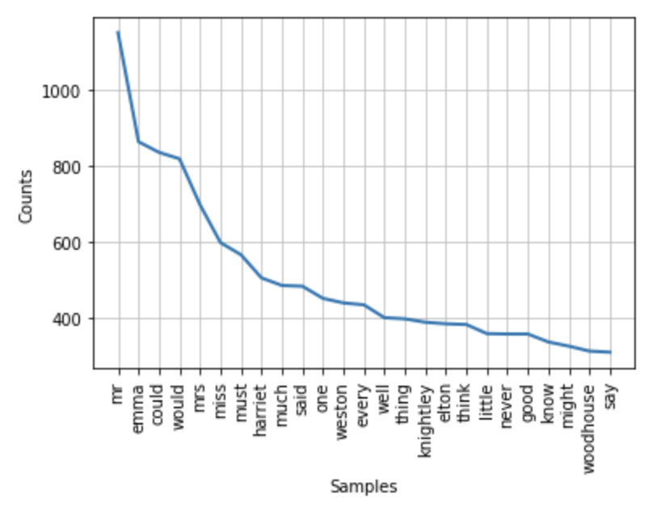

# Visualizing with the Art of Literary Text Mining

## Visualizing with Voyant

<iframe src="https://voyant-tools.org/tool/Knots/?corpus=austen" style="width: 300px; height: 300px; float: right;"></iframe>  Voyant is in large part about visualization so we won't spend too much time with it here except to refer to a couple of tools that are perhaps less on the beaten path:

1. Bubbles
1. TextArc

But there are many others, have a look!

## Embedding Voyant

One of the more powerful aspects of Voyant is that you can embed a live, functional tool in another page, much as you would embed a video clip from YouTube or Vimeo. See the [documentation](https://voyant-tools.org/docs/#!/guide/embedding). For instance, the tool to the right has been embedded with this code:<br clear="all">

	<iframe src="https://voyant-tools.org/tool/Austen/?corpus=austen&view=knots"
		style="width: 300px; height=300px; float: right;"></iframe>

It's worth noting that the &lt;iframe&gt; tag is usually filtered out of a markdown document in GitHub, but it *is* possible to embed Voyant into a Jupyter Notebook. Just using the `iframe` tag won't work directly, but you can use the `IFRAME` class from the [IPython.display] module](https://ipython.readthedocs.io/en/stable/api/generated/IPython.display.html?highlight=iframe#classes).

	from IPython.display import IFrame    
	IFrame('https://voyant-tools.org/tool/Cirrus/?corpus=austen', width=300, height=300)


## Visualizing with Jupyter

 One of the benefits of working with libraries like NLTK (which we've already introduced in a previous notebook) is that there are built-in libraries for simple plotting. For example, it's very easy to go from a text to a graph of word frequencies, something like this:

```python
import nltk
%matplotlib inline # magical incantation needed for first graph

emma = nltk.corpus.gutenberg.words('austen-emma.txt') # load words
stopwords = nltk.corpus.stopwords.words("English") # load stopwords
# filter words that are alphabetic and not in stopword list
words = [word.lower() for word in emma if word[0].isalpha() and not word.lower() in stopwords]
freqs = nltk.FreqDist(words) # build frequency list
freqs.plot(25) # plot the top 25 words
```



To continue with graphing, please consult [Getting Graphical]( in the Art of Literary Programming with Python.
