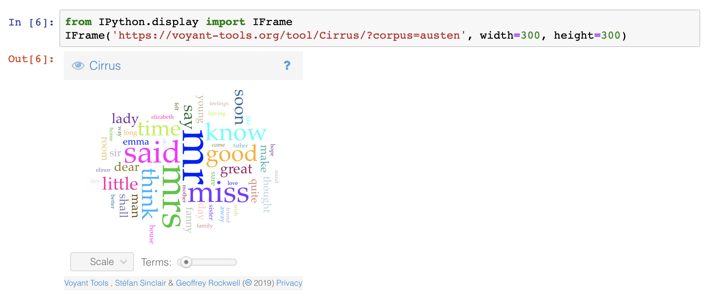

# Visualizing with the Art of Literary Text Mining

<iframe src="https://voyant-tools.org/tool/Knots/?corpus=austen" style="width: 300px; height: 300px; float: right;"></iframe> Voyant is in large part about visualization so we won't spend too much time with it here except to refer to a couple of tools that are perhaps less on the beaten path:

1. Bubbles
1. TextArc

But there are many others, have a look!

## Embedding Voyant

One of the more powerful aspects of Voyant is that you can embed a live, functional tool in another page, much as you would embed a video clip from YouTube or Vimeo. See the [documentations](https://voyant-tools.org/docs/#!/guide/embedding). For instance, the tool to the right has been embedded with this code: 

	<iframe src="https://voyant-tools.org/tool/Austen/?corpus=austen&view=knots"
		style="width: 300px; height=300px; float: right;"></iframe>

It's worth noting that the &lt;iframe&gt; tag is usually filtered out of a markdown document in GitHub, but it *is* possible to embed Voyant into a Jupyter Notebook. Just using the `iframe` tag won't work directly, but you can use the IFRAME module.

!
